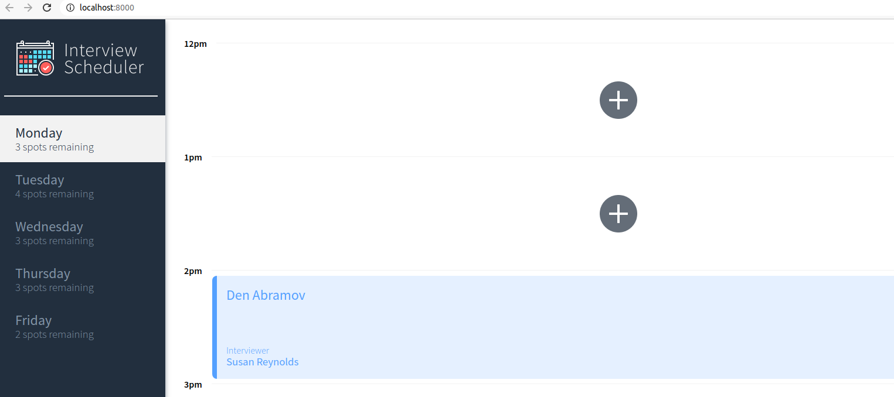
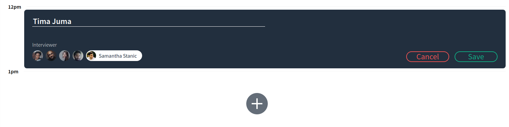
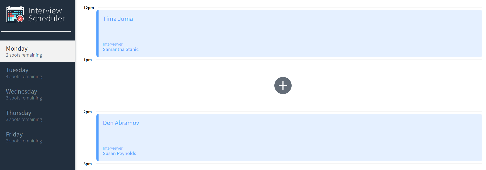
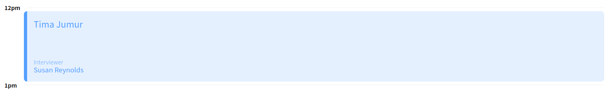
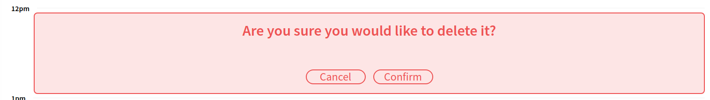
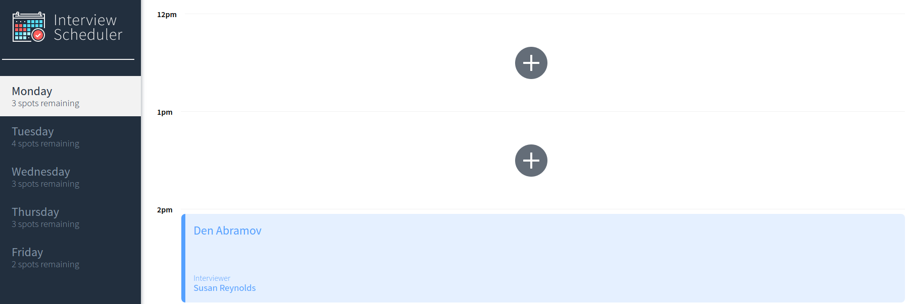

# Interview Scheduler

**This is a FullStack APP with Front END written in React**

This APP allows you to manage your appointments:

- Create appointment by selecting appropriate date
- Edit it
- Delete it

## Setup

Install dependencies with `npm install` and follow further istructionss

## Running Webpack Development Server

```sh
npm start
```

## Running Jest Test Framework

```sh
npm test
```

## Running Storybook Visual Testbed

```sh
npm run storybook
```

## The views of Final implementation

#### 1. View all the available appointments with remaining spots on each day



#### 2. Create a new appointment



#### 3. Created an appointment and spots remaining updated accordingly



#### 4. Edit the appointment



#### 5. Delete confirmation component rendered



#### 6. Deleted and spots remaining updated accordingly


